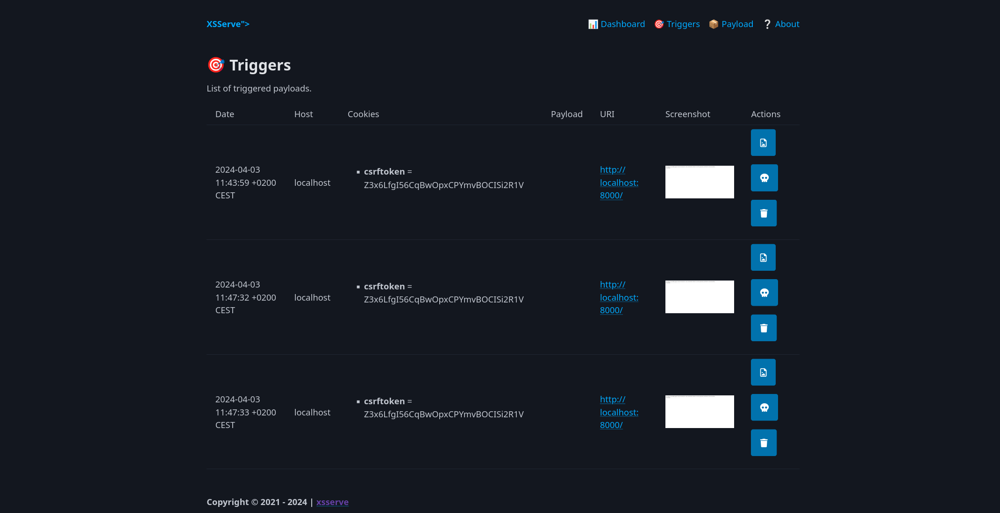
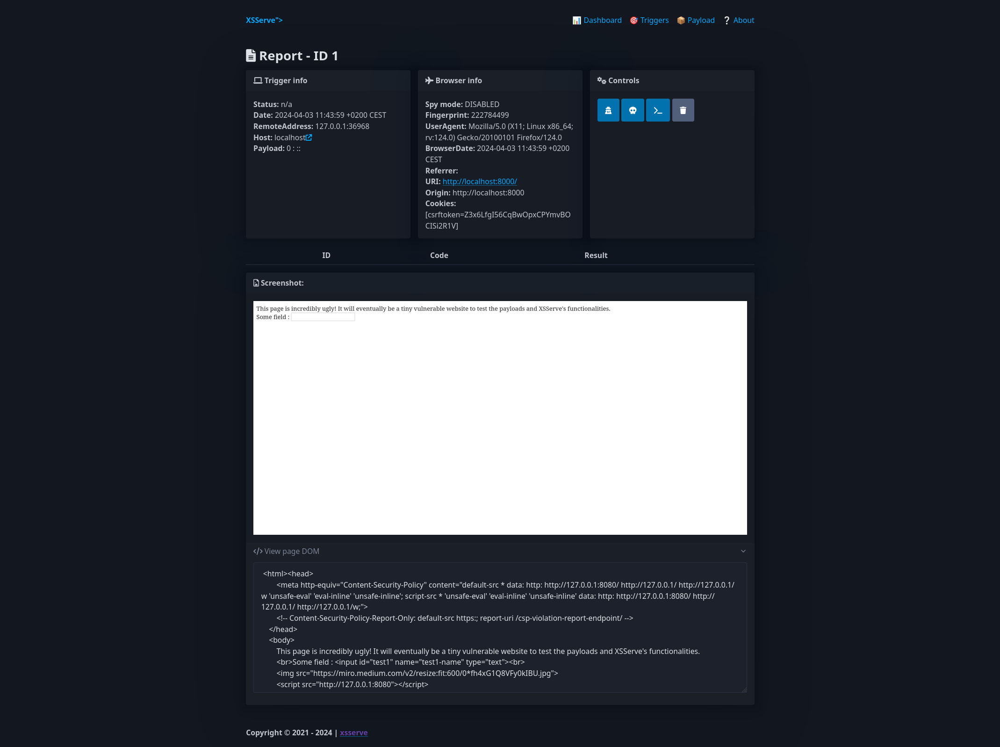

# XSServe

XSServe is ~~a shameless copy of~~ heavily inspired by the [XSSHunter](https://xsshunter.com) project (by [@IAmMandatory](https://twitter.com/IAmMandatory)), rewritten in Go.

## ⚠ Disclaimer
The project is in a SEMI usable state right now, if you want a prime experience I still suggest the use of other tools.

> NOTE: only basic authentication is supported for the UI for now.

## 📷 Mandatory screenshot(s)





## 🏁 Goals
The initial goal is to allow users to use the same service, but in a self-contained way for lazy penetration testers, like myself.

The final goal is still unclear as the project might evolve as different needs arise. 

The basic **current features** include:
- Blind XSS (screenshot, cookies, DOM) 
- Information gathering (browser fingerprinting, local time and date, UA)
- Automatic session hijacking using Selenium (click big blue button, browse as victim!)
- Websockets for live js injections (like BEeF, but simpler)

**Planned features**:
- Spy mode: see what the user sees, types and points at in real time
- BEeF like plugins and victim browser management
- Report generation
- Cool dashboard to keep track of them pwns
- Payload obfuscation
- Serving of custom js files via API

Possible "**maybe**" features:
- Auto-submit to bug bounty platform(s)
- Enable multiple users (this might need some major refactoring)
- idk?

## 🔧 Build
This project requires at least `golang >= 1.16`, as it makes use of the `embed` package.
To run the project:
```
go run main.go [options]
```

To build it:
```
go build xsserve
```

## 👋 Contributing
Currently I'd love some help with:

- UI/UX: in case it wasn't obvious by the look of it, the UI is pretty ugly. I wouldn't mind a skilled UI designer to do a nice looking interface to ease the usage and look... well... good.
- Developers: I am currently working on this project as I learn Go, in the little free time I have, I am by no means a developer so any advice is appreciated, without overly complicating the project.
- Logo: cause every cool project has a logo.
- Getting a life... Anyone?

If you want to get in touch hit me up on [twitter](https://twitter.com/thatsn0tmysite) or [matrix](https://matrix.to/#/@thatsn0tmysite:matrix.org)!

## ✅ TODO
Here is a list of TODO I have handy, there is much more to do:

- [x] Basic functionality
- [x] Replace DB
- [ ] Dashboard
- [x] Decent UI 
- [x] Logo
- [x] Dynamic blind.js file
- [x] blind.js other fixes / simplify code 
- [x] Dynamic hook.js file
- [ ] Live browser "spy mode" (currently in the works, might change to webrtc later idk)
- [ ] Plugin system for hook.js (capabilityEnum, webcam/mic, live, BitB, keylogger, eventHook)
- [ ] Allow custom files served by /c 
- [x] Self-signed HTTPS certificate on startup
- [ ] Minor mimetype issues
- [x] Better report details page
- [ ] Export reports to md file
- [ ] Secure code review
- [ ] Custom error pages
- [ ] Moar payloads
- [ ] Obfuscate payloads if requested
- [ ] Integrated GeoIP for nonsense IP localization with minimap :)
